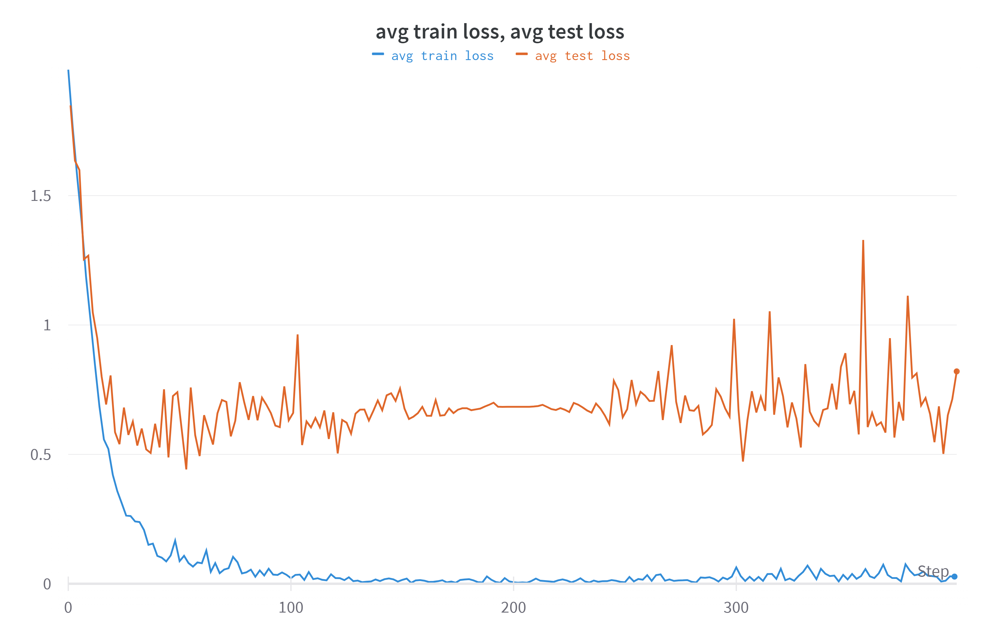
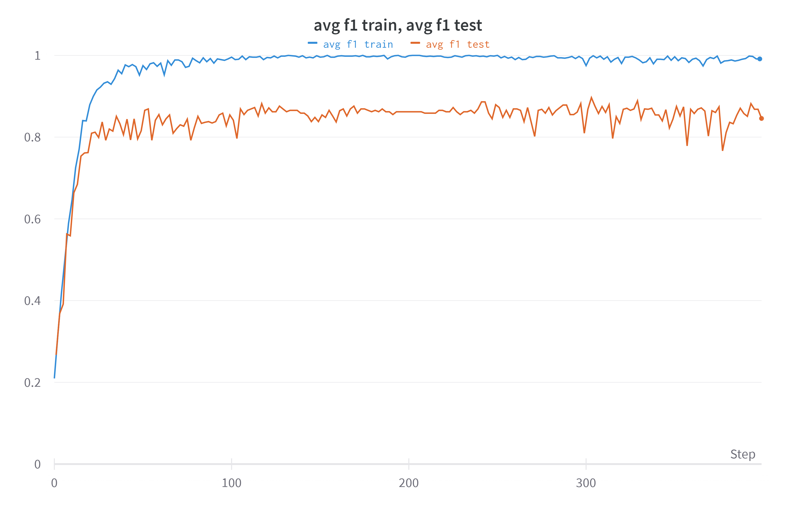
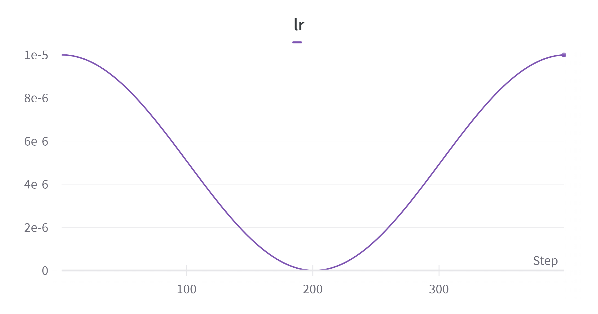

# wav2vec2.0 эксперименты

Для обучения с huggingface была взята модель `Wav2Vec2ForSequenceClassification` ([ссылка](https://huggingface.co/docs/transformers/model_doc/wav2vec2#transformers.TFWav2Vec2ForSequenceClassification)) с предобученными весами из `superb/wav2vec2-base-superb-ks`. Дообучение производилось на датасете [RAVDESS-emotions-speech-audio-only](https://github.com/ZenvilleErasmus/RAVDESS-emotions-speech-audio-only) оптимизатором `Adam`, за метрику выбрана f1-мера. Датасет был разделен на обучающий и валидационный в пропорциях 80 на 20 соответственно.

## Процесс обучения
Подсчет метрики велся для каждого батча, и усреднялось по обучающей выборке.
Логирование производилось в wandb несколько раз в цикле эпохи, поэтому x-ось несколько неправильно отображает данные о числе итераций, их следует делить на 2.
До хороших метрик модель обучается менее чем за 100 эпох. [Лучший чекпоинт](https://disk.yandex.ru/d/Zbi_u9Od7wAokg) имеет `f1-score = 0.89`. Результаты на тестовом датасете записаны в файл `solve.txt`.







## Установка зависимостей

Для установки потребуется `conda`.
- Скачать [чекпоинт](https://disk.yandex.ru/d/Zbi_u9Od7wAokg) и положить в директорию `chkpts`.
- Распаковать [тестовый датасет](https://vk.com/away.php?to=https%3A%2F%2Fdrive.google.com%2Ffile%2Fd%2F1JKA4Y-zJGy9Kh30X4p3DBzilUwTNvJ6W%2Fview%3Fusp%3Dsharing&cc_key=) в `test_emotion_dataset`
```
conda env create -f environment.yml
```

## Запуск 


```bash
python scripts/eval.py # для запуска на тестовом датасете
python scripts/train.py # обучение
```

## Заметки

- Чтобы упаковать данные в батчи некоторые аудиозаписи пришлось дополнять нулями до записи с максимальной длинной, что могло сказаться на качестве и производительности. 
- Хотелось бы добавить некоторый cli интерфейс и очистить код. 
- Эксперименты с SGD показали, что модель не сходится

